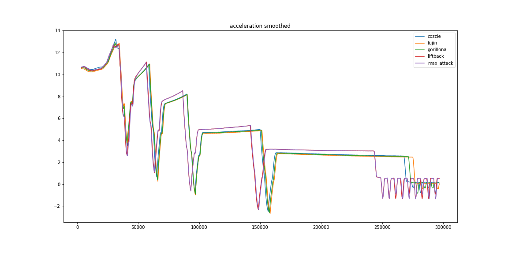
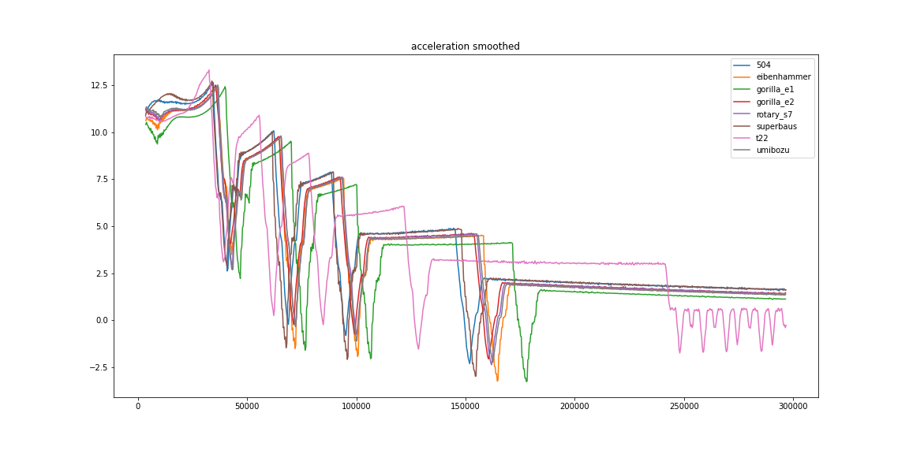

# ArtOfRallyTK
Toolkit for [Art Of Rally](https://artofrally.com/)

### Information for reuse
**All Python (.py) scripts are meant to be run from the root directory.**  
**All jupyter notebooks (.ipynb) are supposed to be run from the current directory.**

### Tools

* [OCR](ocr)  
Read speed, RPM and gear using image processing on the game window screen.
* [AMT](automated-manual-transmission)  
Automated manual transmission, conventional manual transmission with
automatic actuation.  
This project requires [aorc-client](https://github.com/Theaninova/aorc-client) 
  or a working [OCR](ocr)
* [aorc-logger](aorc-logger)  
Log speed, RPM and gear of running game using
[aorc-client](https://github.com/Theaninova/aorc-client) mod.
* [Dashboard](dashboard)  
Show speed, RPM, gear and steering of running game reading process memory.  
This project requires an up to date [cheat table](cheat-table)
* [Dashboard Logger](dashboard-logger)  
Log speed, RPM, gear and  steering of running game reading process memory.  
This project requires an up to date [cheat table](cheat-table)
* [Leaderboards](leaderboards)  
Scrap leaderboards using funselektorfun.com api

### Sub-Project

* [ArtOfRallyFFFMap](https://github.com/Cyril-Meyer/ArtOfRallyFFFMap)  
ArtOfRally Flat Finland Freeroam Map. A flat map for debug and experiences.

### Car Benchmarks
The [car-benchmarks](car-benchmarks) folder contains benchmark results for some
cars.
We use [ArtOfRallyFFFMap](https://github.com/Cyril-Meyer/ArtOfRallyFFFMap) to
compare speed and acceleration in a controlled environment.
The data where acquired using [aorc-logger](aorc-logger).

### Result examples

#### [AMT](automated-manual-transmission)

| realtime amt |
|---|
||

#### [OCR](ocr)

| realtime ocr |
|---|
||

#### [Dashboard](dashboard)

| speed graph : 60s vs Group A |
|---|
||
||

### [Car Benchmarks](car-benchmarks)

| Car           | run max speed | 0-75   | 0-100  | 0-120  | 0-150  | 15s AUC  | 5s AUC   |
|---------------|---------------|--------|--------|--------|--------|----------|----------|
|        cozzie |         204.35|   2.487|   3.651|   4.505|   6.886|    209645|     35842|
|         fujin |         204.83|   2.483|   3.652|   4.518|   6.934|    208949|     35894|
|     gorillona |         204.66|   2.482|   3.651|   4.518|   6.902|    209137|     35907|
|      liftback |         198.82|   2.499|   3.663|   4.484|   6.816|    209116|     35658|
|    max_attack |         198.85|   2.497|   3.667|   4.486|   6.814|    208746|     35484|
|           504 |         212.18|   2.421|   3.633|   4.517|   6.986|    202513|     36518|
|   eibenhammer |         218.13|   2.423|    3.35|   4.655|   7.252|    199945|     36108|
|    gorilla_e1 |         218.35|   2.519|   3.448|   4.783|   7.448|    198355|     35489|
|    gorilla_e2 |         218.11|   2.438|   3.335|   4.584|   7.072|    202519|     36226|
|     rotary_s7 |         218.04|   2.469|   3.371|   4.619|   7.104|    201992|     36254|
|     superbaus |         211.98|   2.382|   3.652|   4.549|   7.116|    201545|     36635|
|           t22 |         193.74|   2.465|   3.651|   4.948|   7.485|    204981|     35569|
|       umibozu |         218.22|   2.431|    3.35|   4.602|   7.136|    201549|     36281|

| acceleration |
|---|
||
||

#### [Leaderboards](leaderboards)

| most used car in top 50 by group |
|---|
||
||
||

### Acknowledgement

I would never have embarked on the mod creation project for this game if
it was not as interesting.
Thanks to [funselektor](https://funselektor.com/) for their great game.

Thanks a lot to [Thea Schöbl](https://github.com/Theaninova) for her help and
work around the Art of Rally modding community.

Thanks to [Dacarpe03](https://github.com/Dacarpe03) for his
[ArtOfRallyAI](https://github.com/Dacarpe03/ArtOfRallyAI) project, who made
me want to get into the modding 'game'. (to beat him by doing better of course)
