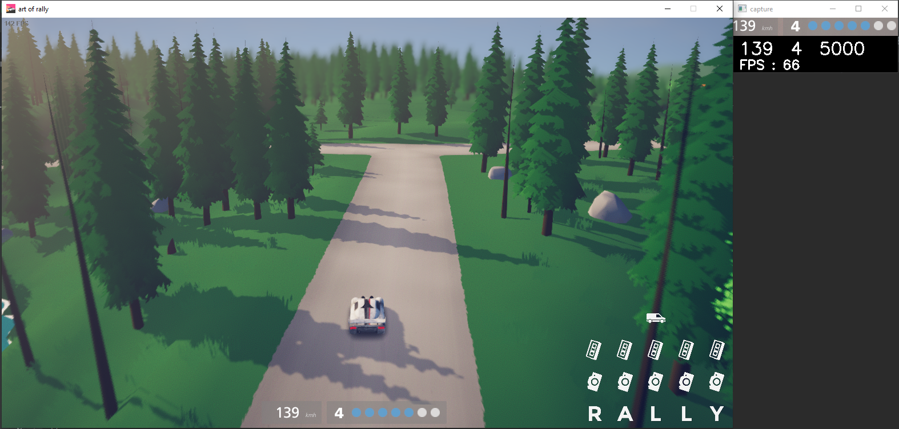
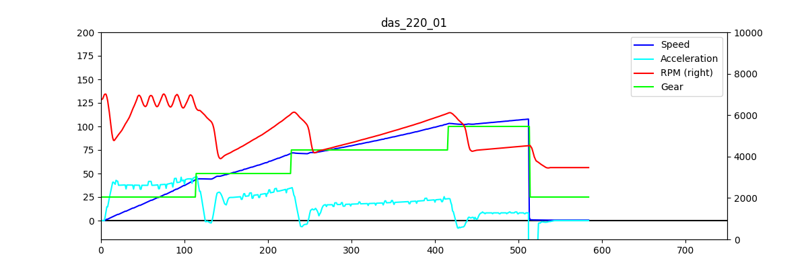
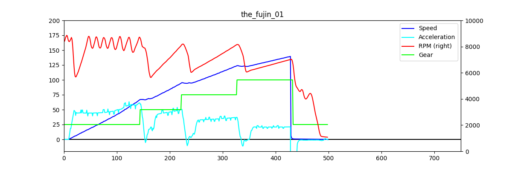
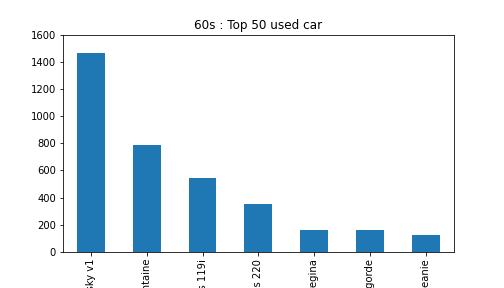
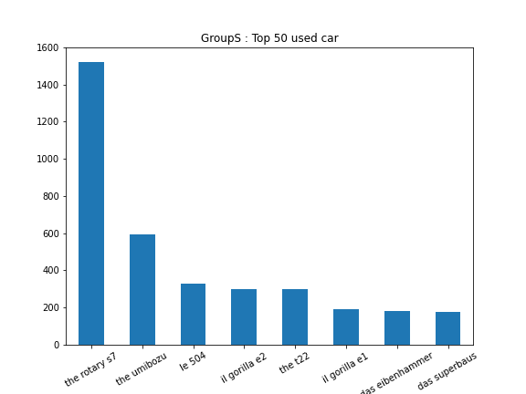
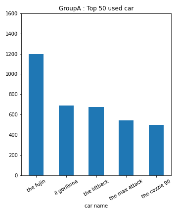

# ArtOfRallyTK
Toolkit for [Art Of Rally](https://artofrally.com/)

### Information for reuse
**All Python (.py) scripts are meant to be run from the root directory.**  
**All jupyter notebooks (.ipynb) are supposed to be run from the current directory.**

### Tools

* [OCR](ocr)  
Read speed, RPM and gear using image processing on the game window screen.
* [AMT](automated-manual-transmission)  
Automated manual transmission, conventional manual transmission with
automatic actuation.  
This project requires a working [OCR](ocr)
* [aorc-logger](aorc-logger)  
Log speed, RPM and gear of running game using
[aorc-client](https://github.com/Theaninova/aorc-client) mod.
* [Dashboard](dashboard)  
Show speed, RPM, gear and steering of running game reading process memory.  
This project requires an up to date [cheat table](cheat-table)
* [Dashboard Logger](dashboard-logger)  
Log speed, RPM, gear and  steering of running game reading process memory.  
This project requires an up to date [cheat table](cheat-table)
* [Leaderboards](leaderboards)  
Scrap leaderboards using funselektorfun.com api

### Sub-Project

* [ArtOfRallyFFFMap](https://github.com/Cyril-Meyer/ArtOfRallyFFFMap)  
ArtOfRally Flat Finland Freeroam Map. A flat map for debug and experiences.

### Car Benchmarks
The [car-benchmarks](car-benchmarks) folder contains benchmark results for some
cars.
We use [ArtOfRallyFFFMap](https://github.com/Cyril-Meyer/ArtOfRallyFFFMap) to
compare speed and acceleration in a controlled environment.
The data where acquired using [aorc-logger](aorc-logger).

### Result examples

#### [AMT](automated-manual-transmission)

| realtime amt |
|---|
||

#### [OCR](ocr)

| realtime ocr |
|---|
||

#### [Dashboard](dashboard)

| speed graph : 60s vs Group A |
|---|
||
||

#### [Leaderboards](leaderboards)

| most used car in top 50 by group |
|---|
||
||
||

### Acknowledgement

I would never have embarked on the mod creation project for this game if
it was not as interesting.
Thanks to [funselektor](https://funselektor.com/) for their great game.

Thanks a lot to [Thea Schöbl](https://github.com/Theaninova) for her help and
work around the Art of Rally modding community.

Thanks to [Dacarpe03](https://github.com/Dacarpe03) for his
[ArtOfRallyAI](https://github.com/Dacarpe03/ArtOfRallyAI) project, who made
me want to get into the modding 'game'. (to beat him by doing better of course)
