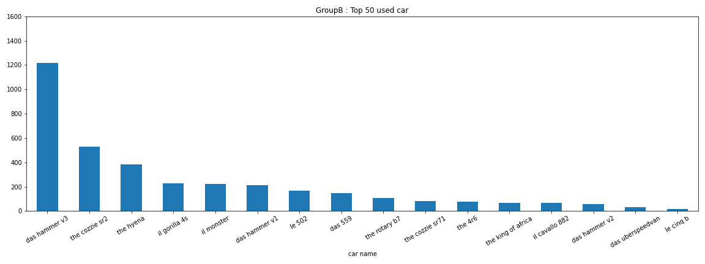

# ArtOfRallyTK
Toolkit for [Art Of Rally](https://artofrally.com/)

### Information for reuse
**All Python (.py) scripts are meant to be run from the root directory.**  
**All jupyter notebooks (.ipynb) are supposed to be run from the current directory.**

### Tools

* [Dashboard](dashboard)  
Read and log speed, RPM and engaged gear of running game  
This project require an up to date [cheat table](cheat-table)
* [Leaderboards](leaderboards)  
Scrap leaderboards using funselektorfun.com api

### Result examples

| speed graph : 60s vs Group A |
|-|
||
||

| most used car in top 50 by group |
|-|
||
||
||
||
||
||

### Acknowledgement
