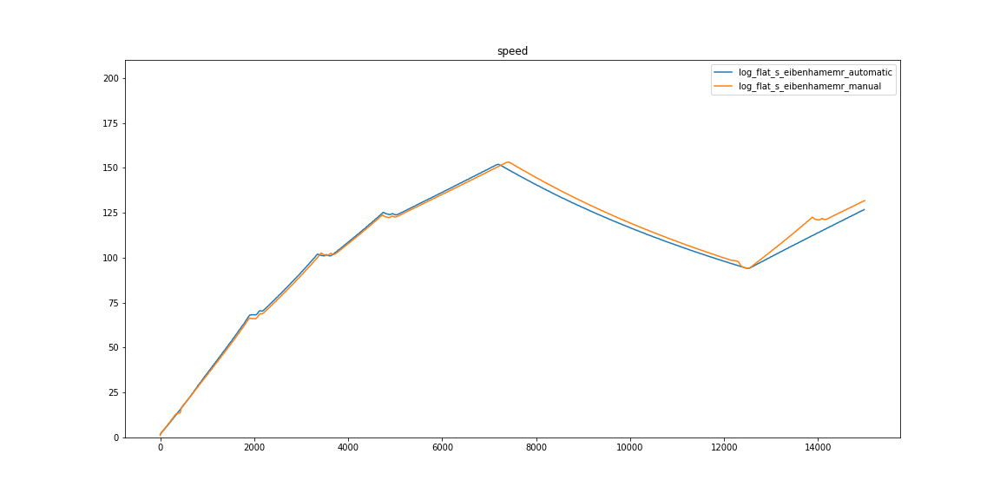
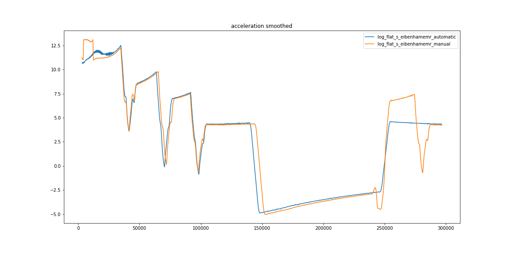
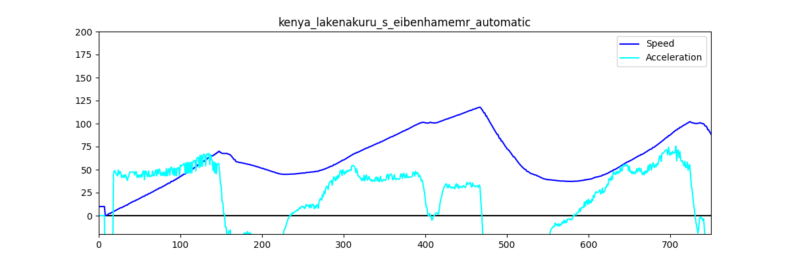
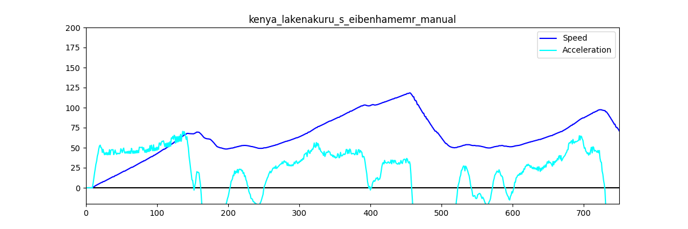

# ArtOfRallyTK AMT

Art of Rally Automated Manual Transmission

Our automated manual transmission has no advantage when it comes to upshifting, but does allow downshifting in interesting cases.
The game tends to never downshift as much as possible, even if it's not profitable.

Create your transmission profile in json (examples in [gearbox_settings](gearbox_settings)).
Each gear has a min and max value.
````
{
  "1": {
    "min": "0",
    "max": "50"
  },
  
  [...]
  
  "5": {
    "min": "100",
    "max": "300"
  }
}

````

## AORC based AMT

This version use a listening server with the
[Theaninova/aorc-client](https://github.com/Theaninova/aorc-client) mod.

| logs visualizations |
|---|
||
||

## OCR based AMT (old version)

[](https://www.youtube.com/watch?v=DsTWGiM55rg)  
https://youtu.be/DsTWGiM55rg

### Art of Rally setup

<table>
  <tr><td>option</td><td>value</td></tr>
  <tr><td colspan="2">gameplay</td></tr>
  <tr><td>transmission</td><td>manual</td></tr>
  <tr><td colspan="2">graphics</td></tr>
  <tr><td>fullscreen</td><td>windowed</td></tr>
  <tr><td>resolution</td><td>1280 x 720</td></tr>
  <tr><td>quality</td><td>medium</td></tr>
</table>

| logs visualizations |
|---|
| Automatic |
||
| Manual |
||
