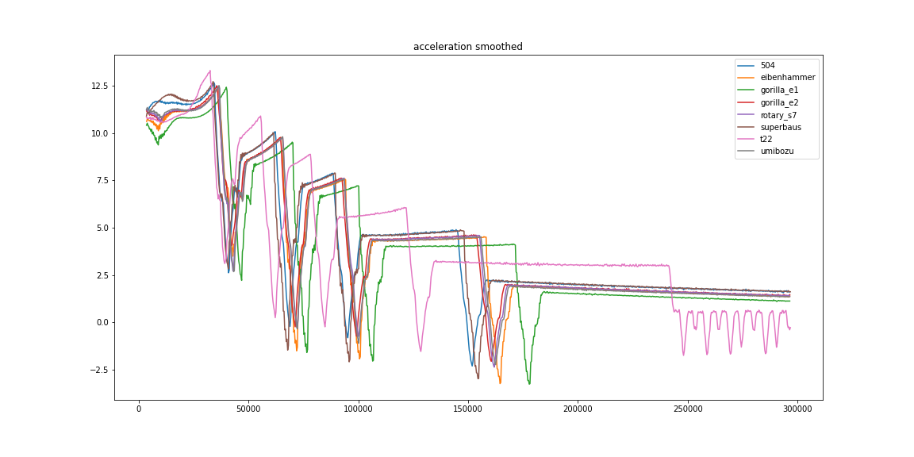

# ArtOfRallyTK - Car Benchmarks

Benchmarking speed and acceleration in straight line using a flat map.

Experimental procedure :
* Initial setup
    * enable [No Reset Mod](https://www.nexusmods.com/artofrally/mods/5) mod
    * enable [aorc-client](https://github.com/Theaninova/aorc-client) mod
    * launch [aorc-logger](https://github.com/Cyril-Meyer/ArtOfRallyTK/tree/main/aorc-logger) server
* For each car to test
    * select car
    * go to freeroam first map
    * enable / disable [ArtOfRallyFFFMap](https://github.com/Cyril-Meyer/ArtOfRallyFFFMap)
    to get a flat map
    * little turn to the left to have no obstacle
    * write filename wanted into aorc-logger
    * press Z for 30s

This procedure will create a `.csv` file containing results of the benchmark.

# Results

### Group A
| Car           | run max speed | 0-75   | 0-100  | 0-120  | 0-150  | 15s AUC  | 5s AUC   |
|---------------|---------------|--------|--------|--------|--------|----------|----------|
|        cozzie |         204.35|   2.487|   3.651|   4.505|   6.886|    209645|     35842|
|         fujin |         204.83|   2.483|   3.652|   4.518|   6.934|    208949|     35894|
|     gorillona |         204.66|   2.482|   3.651|   4.518|   6.902|    209137|     35907|
|      liftback |         198.82|   2.499|   3.663|   4.484|   6.816|    209116|     35658|
|    max_attack |         198.85|   2.497|   3.667|   4.486|   6.814|    208746|     35484|

### Group S
| Car           | run max speed | 0-75   | 0-100  | 0-120  | 0-150  | 15s AUC  | 5s AUC   |
|---------------|---------------|--------|--------|--------|--------|----------|----------|
|           504 |         212.18|   2.421|   3.633|   4.517|   6.986|    202513|     36518|
|   eibenhammer |         218.13|   2.423|    3.35|   4.655|   7.252|    199945|     36108|
|    gorilla_e1 |         218.35|   2.519|   3.448|   4.783|   7.448|    198355|     35489|
|    gorilla_e2 |         218.11|   2.438|   3.335|   4.584|   7.072|    202519|     36226|
|     rotary_s7 |         218.04|   2.469|   3.371|   4.619|   7.104|    201992|     36254|
|     superbaus |         211.98|   2.382|   3.652|   4.549|   7.116|    201545|     36635|
|           t22 |         193.74|   2.465|   3.651|   4.948|   7.485|    204981|     35569|
|       umibozu |         218.22|   2.431|    3.35|   4.602|   7.136|    201549|     36281|

### Group A

| logs visualizations |
|---|
||
||
||
||

### Group S

| logs visualizations |
|---|
||
||
||
||
