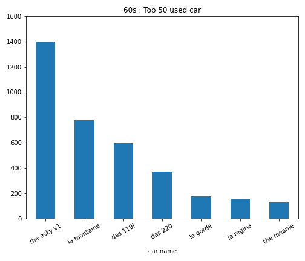
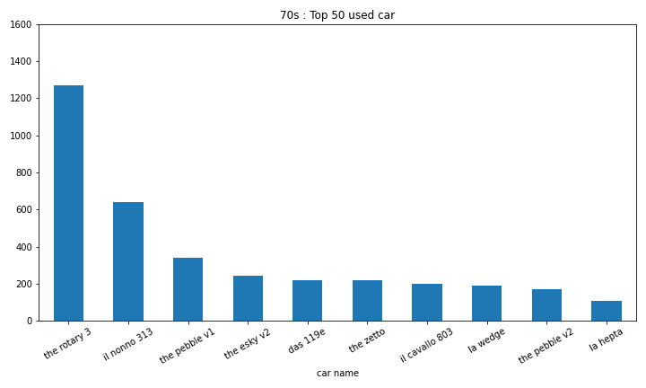
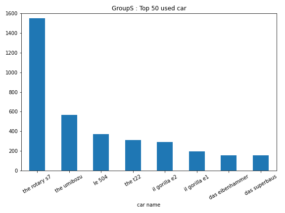

# ArtOfRallyTK Leaderboards

### Scripts
* `leaderboards.py` : read top 1000 of each board and store the result as .csv.
  (one csv per car class)  
* `cars.py` : dictionary for cars
* `visualize.ipynb` plot `leaderboards.py` results (also used for statistics).

### API documentation

Base url : `https://www.funselektorfun.com`

| path | description |
|---|---|
| /artofrally/leaderboard | get leaderboard |
| /artofrally/replayData | get replay data |
| /artofrally/leaderboardEntry | post leaderboard entry |
| /artofrally/replayEntry | post replay |
| /artofrally/userInfo | post user info |
| /absolutedrift/ping | get leaderboard connection |

#### /leaderboard
Format : `/boardId/selection`

##### boardId 
boardId string is formatted as this : 
```
{area}_{stage}_{direction}_{weather}_{carClasse}
```
With the following values :
```
areas = ['Finland', 'Sardinia', 'Japan', 'Norway', 'Germany', 'Kenya']
stages = ['Stage_1', 'Stage_2', 'Stage_3', 'Stage_4', 'Stage_5', 'Stage_6']
directions = ['Forward', 'Reverse']
weathers = ['Wet', 'Dry']
carClasses = ['60s', '70s', '80s', 'GroupB', 'GroupS', 'GroupA']
```

example : `Finland_Stage_1_Forward_Dry_60s`

##### selection 

| value | description |
|---|---|
| `/0` | top 10 |
| `/1/2/[userid]` | around userid (need to provide a userid) |
| `/2/N` | with N an integer, get leaderboard from N to (N*10+10) |
| `/3` | get number of entry |

*You can also use `/0/platform` to also get the id for a specific platform.*

#### examples

* get top 10 :  
  `https://www.funselektorfun.com/artofrally/leaderboard/Kenya_Stage_6_Reverse_Dry_GroupS/0/2`

* get top 11 - 10000  
  `https://www.funselektorfun.com/artofrally/leaderboard/Kenya_Stage_6_Reverse_Dry_GroupS/2/10`

### Result examples

**most competitive group**

| group    | mean of standard deviations | mean of mean distance to the first |
|----------|-----------------------------|------------------------------------|
|      60s |                     3630.85 |                            10440.7 |
|      70s |                     3649.33 |                             9982.8 |
|      80s |                     3313.13 |                             9140.1 |
|   GroupB |                     3270.98 |                             9237.3 |
|   GroupS |                      3242.0 |                             9552.6 |
|   GroupA |                     2768.51 |                             8384.6 |

| most used car by the top 50 per group |
|---|
||
||
||
||
||
||

### How to find all this information ?

* [Fiddler 4](https://www.telerik.com/fiddler/fiddler-classic)
* [dnSpy](https://github.com/dnSpy/dnSpy)


This documentation is based on my usage for the leaderboard scrapping.
Another user made a documentation which you can be interested by :
[Theaninova/ArtOfRallyLeaderboardAPI](https://github.com/Theaninova/ArtOfRallyLeaderboardAPI)
